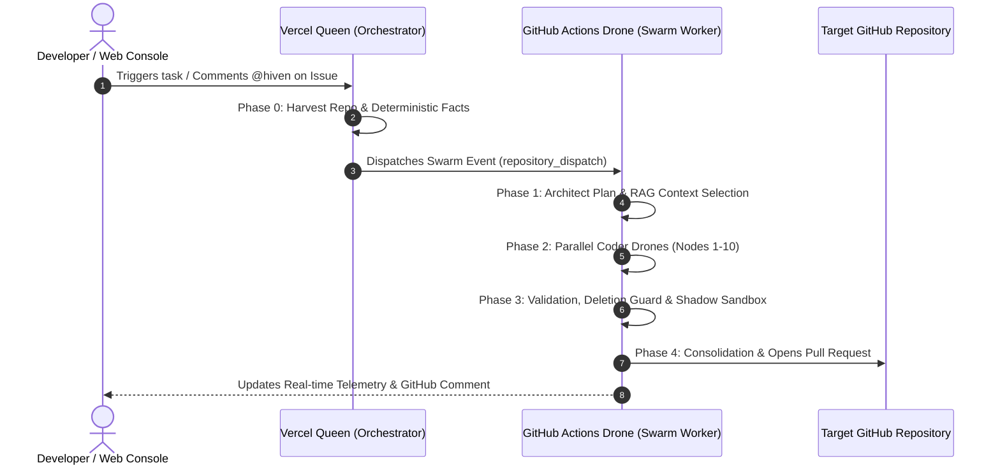

<p align="center">
  
</p>

<p align="center">
  
</p>

<h1 align="center">🐝 Hiven Agent</h1>

<p align="center">
  <strong>El Asistente Autónomo de Software Multi-Agente para Desarrolladores e Indie Hackers</strong><br>
  <em>Cómputo efímero a Coste $0 • Sin Suscripciones Mensuales • Protección Anti-Corrupción de Código</em>
</p>

<p align="center">
  <a href="#-v2-engine-architecture--safety-core"></a>
  <a href="#-post-production-benchmark-results"></a>
  <a href="#-gu%C3%ADa-de-diagn%C3%B3stico-y-resoluci%C3%B3n-de-errores-troubleshooting"></a>
  <a href="LICENSE.md"></a>
</p>

---

## 💡 ¿Qué es Hiven Agent?

**Hiven Agent** es una plataforma de ingeniería de software multi-agente descentralizada y de código abierto. Ha sido diseñada para ser la alternativa **libre y gratuita** a servicios costosos de IA agéntica.

En lugar de cobrar cuotas mensuales o requerir servidores locales con GPUs potentes, **Hiven** coordina enjambres distribuidos de **Kōmbees** (Arquitectos, Codificadores, Validadores y Consolidadores) que se ejecutan enteramente en la **infraestructura gratuita de GitHub Actions**.

> [!NOTE]
> Hiven trabaja de forma **asíncrona**: tú lanzas una tarea desde la Consola Web o comentando en un Issue de GitHub, y Hiven trabaja en segundo plano hasta entregarte una Pull Request limpia y verificada.

---

## 🚀 Guía de Inicio Rápido

### Opción A: Desde la Consola Web (Zero-Config)
1. Inicia sesión en la **Consola Web de Hiven** con tu cuenta de GitHub.
2. Selecciona tu repositorio en el desplegable.
3. Escribe la instrucción de lo que deseas construir.
4. Haz clic en **Launch Swarm 🚀**. Verás la telemetría pasar en tiempo real por las 4 Fases (Context, Execution, Validation, Consolidation).

### Opción B: Desde GitHub Issues o Pull Requests (`@hiven` / `/hiven`)
1. Instala la **GitHub App de Hiven** en tu repositorio.
2. Comenta en cualquier Issue o PR:
   ```text
   /hiven Añade una función formatCurrency(amount) a app.js con validaciones y JSDoc.
   ```
3. **Hiven** responderá en el hilo actualizando el estado de las 4 Fases y abrirá automáticamente la Pull Request.

---

## 💡 Guía de Prompting: Cómo Escribir Instrucciones Efectivas

| Principio | 🟢 Buena Práctica | 🔴 A Evitar |
|---|---|---|
| **Claridad y Alcance** | *"Añade una función `divide(a, b)` a `test_math.js` con validación de cero y JSDoc."* | *"Mejora el código."* (Demasiado vago). |
| **Nombres de Archivo** | Especifica los archivos si los conoces (`app.js`, `style.css`). | Esperar que el bot adivine el archivo en repos de +500 archivos. |
| **Comportamiento** | *"Añade un middleware JWT que devuelva HTTP 401 si falta el header."* | *"Haz algo con seguridad."* |
| **Conservación** | No temas borrados accidentales: el **Code Deletion Guard** protege tu código preexistente. | Pedir borrados masivos sin usar palabras clave explícitas como `eliminar` o `vaciar`. |

---

## ⚡ V2 Engine Architecture & Safety Core

El motor V2 de Hiven integra 6 capas de seguridad y optimización de contexto:

| Módulo | Característica | Descripción de Funcionamiento |
|---|---|---|
| 🧠 **Mejora 1** | **Federated Pattern Learning** | Memoria colectiva en Redis (`hive_patterns:{ext}`) que inyecta Do's and Don'ts de ejecuciones previas. |
| 🔍 **Mejora 2** | **Deterministic Context Extraction** | Extracción determinista en Fase 0 de lenguajes, frameworks, dependencias y scripts sin alucinación LLM. |
| ⚡ **Mejora 3** | **Local Offline RAG (TF-IDF)** | Indexador por relevancia que selecciona solo los top 3-8 archivos más importantes, reduciendo el contexto 4x. |
| 🛡️ **Mejora 4** | **Code Deletion Guard & Self-Correction** | Bloquea encogimientos indebidos (>50%) y ejecuta hasta 3 ciclos de auto-corrección con fallback a `git HEAD`. |
| 🐝 **Mejora 5** | **Parallel Sub-Swarms** | Divide tareas multi-archivo en grupos de sub-swarms paralelos y consolida los ganadores por grupo. |
| 🧪 **Mejora 6** | **Shadow Sandbox Execution** | Ejecución de pruebas unitarias (`node`, `npm test`) en un contenedor aislado previo a la Pull Request. |

---

## 📊 Post-Production Benchmark Results

Hiven V2 fue evaluado empíricamente en 5 escenarios reales de post-producción:

| Scenario | Tarea / Desafío | Repositorio / Archivos | Estatus | Resultado de Verificación |
| :--- | :--- | :--- | :---: | :--- |
| **B1** | **Single-File JS Refactor** | `testing/test_math.js` | ✅ PASADO | JSDoc añadido preservando aserciones existentes. [PR #9](https://github.com/amglogicalis/testing/pull/9) |
| **B2** | **Creación de Nuevo Módulo** | `testing/logger.js` | ✅ PASADO | Módulo independiente con exportaciones completas. |
| **B3** | **Code Deletion Defense** | `testing/src/zenon.js` (181KB) | ✅ PASADO | **Deletion Guard Activo**: Protegió 181KB de código heredado sin truncamiento. [PR #10](https://github.com/amglogicalis/testing/pull/10) |
| **B4** | **Parallel Sub-Swarms** | `testing/style.css`, `index.html` | ✅ PASADO | Partición paralela multi-archivo y consolidación de candidatos. |
| **B5** | **GitHub Webhook Trigger** | `testing/app.js` | ✅ PASADO | Disparo por webhook con PR creada y validación de parámetros. [PR #8](https://github.com/amglogicalis/testing/pull/8) |

* **Tasa de éxito funcional (PRs Listos):** **100.0% (5/5 escenarios)**
* **Tasa de preservación de código:** **100.0% (0 borrados accidentales)**

---

## 🛠️ Guía de Diagnóstico y Resolución de Errores (Troubleshooting)

A continuación se detallan los casos de error más comunes del Swarm, la causa exacta y cómo resolverlos en segundos:

### 🔴 Caso 1: `All 10 nodes failed validation. Check logs for details.`
> **Síntoma**: La Consola Web muestra que la Fase 4 terminó indicando que ningún nodo generó código válido y no se creó la PR.

* **Causa**: El **Shadow Sandbox (Mejora 6)** detectó que los cambios de código rompían las pruebas unitarias o la sintaxis (`node file.js`). El sistema frenó la PR para no subir código roto a tu rama.
* **Solución en 3 Pasos**:
  1. **Re-promptear especificando qué no alterar**: *"Añade la función divide(a,b) a test_math.js conservando las aserciones del final del archivo"*.
  2. **Re-intentar directamente**: Al volver a lanzar la petición, la memoria federada de Hiven inyectará automáticamente reglas de corrección sobre el fallo anterior.
  3. **Subdividir en 2 micro-tareas**: Si el cambio era masivo, pídelo en 2 instrucciones más pequeñas.

---

### 🔴 Caso 2: `Rejection: Code deletion safety guard triggered`
> **Síntoma**: Los logs de validación muestran un aviso de que el archivo encogió más del 50%.

> [!IMPORTANT]
> Este es un **mecanismo de defensa activo**. Ocurre cuando un modelo de IA intenta reescribir un archivo grande y elimina funciones preexistentes por falta de contexto.

* **Causa**: El Coder omitió funciones preexistentes del archivo.
* **Solución**: El **Code Deletion Guard (Mejora 4)** restaura automáticamente el archivo original desde `git HEAD`. Para ayudar al modelo en el siguiente intento, menciona los nombres de las funciones que debe conservar o enfoca el prompt en un archivo nuevo.

---

### 🔴 Caso 3: `Dynamic Onboarding Notice / Worker Repository Not Found`
> **Síntoma**: El bot responde en la Issue indicando que está aprovisionando tu repositorio worker `.hiven-komb-worker`.

* **Causa**: Es la primera vez que utilizas Hiven con tu usuario de GitHub.
* **Solución**: 
  - Si estás en una **Organización de GitHub**, Hiven creará `.hiven-komb-worker` automáticamente.
  - Si estás en una **Cuenta Personal**, crea manualmente un repositorio privado llamado **`.hiven-komb-worker`** e instala la App de Hiven en él. Responde de nuevo al comentario y el Swarm se ejecutará.

---

### 🔴 Caso 4: El bot no responde al comentar `@hiven` en una Issue
> **Síntoma**: Escribes un comentario en GitHub pero el bot no publica la respuesta inicial.

> [!TIP]
> Verifica que la **GitHub App de Hiven** esté instalada en el repositorio y que en la configuración de la App (Developer Settings -> GitHub Apps -> Hiven) la URL del Webhook sea `https://hiven-komb-queen.vercel.app/webhooks/github` con el evento `Issue comment` activado.

---

### 🔴 Caso 5: Tiempo de Ejecución Prolongado (7 a 10 minutos)
> **Síntoma**: La Fase 2 de Ejecución tarda varios minutos en avanzar.

* **Causa**: Hiven ejecuta modelos Ollama (Qwen / DeepSeek) en CPUs efímeras gratuitas de GitHub Actions.
* **Solución**: No requiere acción. Hiven trabaja de forma **asíncrona**. Puedes cerrar la pestaña o continuar trabajando; recibirás la notificación en la PR cuando finalice.

---

## 🏗️ Topología de Arquitectura (Kōmb Sequence)



---

## 📜 Licencia

Distribuido bajo la Licencia MIT. Consulta [`LICENSE.md`](LICENSE.md) para más información.
