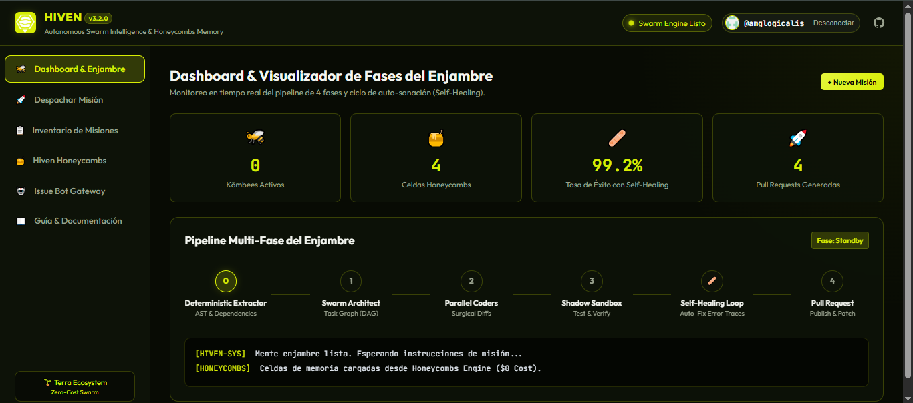

<p align="center">
  
</p>

<h1 align="center">HIVEN V3.2</h1>

<p align="center">
  <strong>El Primer Titán de Ingeniería de Software Autónomo, Mente Enjambre & Memoria Colectiva Honeycombs a Coste $0</strong>
</p>

<p align="center">
  <a href="https://amglogicalis.github.io/hiven-repo-public/"></a>
  <a href="https://www.npmjs.com/package/terra-hiven"></a>
  
  
  
</p>

<p align="center">
  <a href="#-demostración-visual--consola-online">Consola Online</a> •
  <a href="#-por-qué-hiven-supera-a-github-copilot-devin-y-asistentes-convencionales">¿Por qué supera a Copilot?</a> •
  <a href="#-pipeline-de-4-fases--bucle-de-auto-sanación-99">Pipeline & Self-Healing</a> •
  <a href="#-instalación-del-cli-y-sdk">Instalación</a> •
  <a href="#-manual-de-buen-prompting">Buen Prompting</a> •
  <a href="#-hiven-honeycombs-memoria-de-dos-niveles">Honeycombs</a> •
  <a href="#-swarm-rest-api-para-sphexn">REST API & Sphexn</a> •
  <a href="#-preguntas-frecuentes-faq">FAQ</a>
</p>

---

## 🖥️ Demostración Visual & Consola Online

Accede a la consola web interactiva alojada en GitHub Pages sin necesidad de instalar nada en tu ordenador:  
👉 **[Abrir Hiven Studio Web Console Online](https://amglogicalis.github.io/hiven-repo-public/)**

<p align="center">
  
</p>

---

## ⚔️ ¿Por qué Hiven supera a GitHub Copilot, Devin y Asistentes Convencionales?

La mayoría de herramientas de IA para desarrolladores son asistentes pasivos de autocompletado o agentes monolíticos en la nube con costes exorbitantes. **Hiven redefine la ingeniería autónoma:**

| Característica / Capacidad | GitHub Copilot / Cursor | Devin / Cognition AI | 🐝 HIVEN V3.2 (Terra) |
| :--- | :--- | :--- | :--- |
| **Coste Mensual de Licencia** | $10 – $39 / mes por usuario | $500 / mes (Seat tier) | **$0 Coste Marginal Permanente** (Minutos GitHub) |
| **Autonomía Operativa** | Pasivo (Autocompleta texto en IDE) | Autónomo pero cerrado en nube ajena | **Enjambre Autónomo Multi-Agente en tu propio Git** |
| **Verificación de Tests (Sandbox)** | ❌ Ninguna (Alucina código que no compila) | Parcial en VM remota | **✅ Shadow Sandbox Efímero antes de cada commit** |
| **Bucle de Auto-Sanación (Self-Healing)**| ❌ El usuario debe arreglar los errores | Lento y costoso en tokens | **✅ Bucle Cerrado (3-5x) con análisis de stack traces** |
| **Preservación de Código Existente** | ⚠️ Frecuente truncamiento de archivos | ⚠️ Reescrituras globales de ficheros | **✅ Diffs Quirúrgicos (`SEARCH/REPLACE` atómico)** |
| **Memoria de Aprendizaje** | ❌ Olvida todo en la siguiente sesión | ❌ Sesiones efímeras aisladas | **✅ Honeycombs K/V (Recuerda Do's & Don'ts)** |
| **Soberanía y Privacidad** | ☁️ Telemetría en servidores de terceros | ☁️ Entorno cerrado en servidores de Devin | **🔒 100% en tu GitHub y runners efímeros propios** |
| **Compatibilidad Multi-Proveedor** | Bloqueado a modelos de Microsoft/OpenAI | Bloqueado a su stack interno | **Rotación en Cascada (Mistral, OpenAI, Meta + Ollama)** |

---

## 🌟 Arquitectura de las 4 Fases & Auto-Sanación (99% Éxito)

Hiven no es un chatbot que adivina código: es un sistema determinista de bucle cerrado estructurado en 5 etapas trazables:

```
                                  🐝 HIVEN ENGINE V3.2
                               (Sovereign Multi-Agent Swarm)
                                             │
      ┌──────────────────────┬───────────────┴───────────────┬──────────────────────┐
      ▼                      ▼                               ▼                      ▼
  Fase 0: AST        Fase 1: Architect               Fase 2: Coders          Fase 3: Sandbox
(Sin Alucinación)   (Task Graph / DAG)             (Diffs Quirúrgicos)     (Verificación Tests)
                             │                               │                      │
                             └───────────────┬───────────────┘                      │
                                             ▼                                      ▼
                                   🍯 HIVEN HONEYCOMBS                      [¿Tests Fallan?]
                                (Memoria Do's & Don'ts)                             │
                                             │                              ┌───────┴───────┐
                                             ▼                              ▼               ▼
                                    Fase 4: Consolidator              [🩹 Self-Heal]      [EXIT 0]
                                 (Apertura de PR en GitHub)          (Reinyecta Stack)      │
                                                                            │               ▼
                                                                            └───────► [🚀 PULL REQUEST]
```

1. **Fase 0 (Deterministic Extractor):** Extrae dependencias, imports y tipos del AST en milisegundos sin consumir tokens de IA.
2. **Fase 1 (Swarm Architect):** Descompone la misión en un Grafo Acíclico de Tareas (Task DAG) ordenado secuencialmente.
3. **Fase 2 (Parallel Coders):** Kōmbees concurrentes sintetizan cambios utilizando **bloques quirúrgicos `SEARCH/REPLACE`**. Nunca se reescribe un archivo completo de cero.
4. **Fase 3 (Shadow Sandbox & Self-Healing Loop):** Ejecuta la suite de pruebas unitarias en un entorno aislado. Si se detecta un error, el bucle de auto-sanación captura el `stderr` y el stack trace, lo clasifica como `dontDirective` y genera un parche correctivo hasta lograr compilación limpia (`exit 0`).
5. **Fase 4 (Consolidator):** Publica la rama remota, crea el commit y abre la **Pull Request oficial en GitHub**.

---

## 📦 Instalación del CLI y SDK

El paquete oficial de Hiven está disponible en el registro público de NPM como **`terra-hiven`**:

### 1. Instalación Global del CLI:
```bash
# Directamente desde NPM:
npm install -g terra-hiven

# O instalando el paquete compilado (.tgz):
npm install -g ./terra-hiven-3.2.0.tgz
```

### 2. Uso Instantáneo con `npx` (Sin instalación):
```bash
# Iniciar la Consola Web local:
npx terra-hiven console --port 7460

# Despachar una misión autónoma en un repositorio:
npx terra-hiven run --repo usuario/mi-app --prompt "Implementar autenticación JWT"
```

### 3. Como Dependencia de Proyecto (SDK para Node / Sphexn):
```bash
npm install terra-hiven
```

---

## 💻 Uso del CLI: Comandos & Parámetros

```bash
hiven <comando> [opciones]
```

### Comandos Principales:
* **`hiven console [--port 7460] [--host 0.0.0.0]`**: Inicia la consola web local interactiva y la Swarm REST API simultáneamente.
* **`hiven run --repo <owner/repo> --prompt "<instrucción>"`**: Despacha un enjambre autónomo multi-agente.
* **`hiven status <swarmId>`**: Consulta el progreso, fases y logs de actividad en tiempo real.
* **`hiven honeycombs [list|clear]`**: Inspecciona o gestiona la memoria heurística de patrones.
* **`hiven workflow`**: Genera el archivo YAML para ejecutar el enjambre en GitHub Actions.

### Referencia de Parámetros de `run`:
| Flag | Tipo | Por Defecto | Descripción |
| :--- | :--- | :--- | :--- |
| `--repo` | `owner/repo` | *Requerido* | Repositorio de destino en GitHub. Requiere token con `repo` y `workflow`. |
| `--prompt` | String | *Requerido* | Especificación técnica de la misión en lenguaje natural. |
| `--branch` | String | Auto-generada | Rama de trabajo donde se publicará el commit (ej. `hiven/feature-auth`). |
| `--workers` | Integer (1–10) | `4` | Número de Kōmbees paralelos para particionar código. |
| `--test-cmd`| String | *Opcional* | Comando ejecutado en el Sandbox para verificar cambios (ej. `npm test`). |
| `--retries` | Integer (1–5) | `3` | Rondas máximas de auto-sanación si los tests fallan. |
| `--dry-run` | Flag | `false` | Simula la descomposición y valida diffs en local sin modificar GitHub. |

---

## 🎯 Manual de Buen Prompting para Enjambres

Hiven no es un chatbot; es un enjambre de síntesis determinista. **Los agentes prosperan cuando les das criterios de éxito verificables, no intenciones difusas.**

### La Fórmula en 4 Pasos:
1. **Ubicación & Módulo Objetivo:** Especifica el archivo o directorio a crear o editar (ej. `src/utils/math.ts`).
2. **Contrato de la Interfaz:** Nombres de funciones, parámetros, tipos esperados y estructura del retorno.
3. **Casos Límite & Restricciones:** Manejo de excepciones, timeouts, nulos o compatibilidad ESM.
4. **Criterio de Verificación:** Comando de test unitario o aserciones que deben validarse en el Shadow Sandbox.

#### Comparativa:
* ❌ **Mal Prompt (Vago & Ambiguo):**
  > *"Crea un validador de emails y ponle pruebas."*
* ✅ **Buen Prompt (Específico & Determinista):**
  > *"Crear en `src/validators/email.js` la función `isWorkEmail(email)`. Debe validar formato RFC 5322 y rechazar dominios gratuitos (gmail, yahoo, hotmail). Retornar `{ valid: boolean, domain: string, reason?: string }`. Si el input no es string, lanzar `TypeError`. Exportar en ESM y crear suite de tests con al menos 6 casos límite."*

---

## 🍯 Hiven Honeycombs: Memoria de Dos Niveles

A diferencia de memorias basadas en bases de datos pesadas, Honeycombs es un subsistema K/V ligero ($O(1)$) que almacena directivas heurísticas compactas indexadas por extensión (`hive_patterns:{ext}`):

* **`doDirective` (Lo que Funciona):** Patrones de arquitectura y convenciones probadas que pasaron los tests en verde.
* **`dontDirective` (Lo que Falló):** Antipatrones y trampas descubiertas en el Shadow Sandbox durante el Self-Healing.

### Los Dos Niveles de Memoria:
1. **Nivel 1 (Memoria Local Privada):** Almacenada en tu propia máquina y en tu repositorio privado `.hiven-storage`. Permite purgar patrones individuales con el botón `🗑️`.
2. **Nivel 2 (Mente Colmena Global de Terra):** Red descentralizada federada. Al activarla en la consola (tras aceptar el modal restrictivo de confirmación y privacidad), tu enjambre comparte directivas abstractas y se nutre del conocimiento de toda la red de Terra **sin exponer jamás tokens, credenciales ni código fuente sensible**.

---

## 🔌 Swarm REST API para Sphexn & Servicios Externos

Al ejecutar `hiven console --port 7460`, el servidor HTTP expone la API REST oficial con CORS habilitado:

### Endpoints Disponibles:
* **`POST /api/v1/swarm/dispatch`**: Despacha una misión autónoma.
  ```json
  {
    "repo": "amglogicalis/mi-repositorio",
    "instruction": "Implementar módulo de caché en src/cache.js",
    "workers": 4,
    "testCommand": "npm test",
    "retries": 3
  }
  ```
* **`GET /api/v1/swarm/:id`**: Consulta estado en vivo, porcentaje de avance, logs y URL de la Pull Request.
* **`GET /api/v1/honeycombs/patterns?lang=ts`**: Recupera las directivas Do's & Don'ts aprendidas.
* **`POST /api/v1/honeycombs/patterns`**: Registra nuevos patrones heurísticos en la memoria colectiva.
* **`GET /api/v1/health`**: Estado operativo del motor Hiven y Honeycombs.

### Consumo vía SDK en TypeScript:
```typescript
import { Hiven } from "terra-hiven";

const hiven = new Hiven({ githubToken: process.env.GITHUB_TOKEN });
await hiven.init();

const result = await hiven.dispatchSwarm({
  repo: "amglogicalis/mi-app",
  instruction: "Construir procesador batch con tolerancia a fallos",
  workerCount: 4,
  maxSelfHealingRetries: 3
});

console.log(`Pull Request creada: ${result.pullRequestUrl}`);
```

---

## 🛡️ Inferencia Resiliente: Cascada Cloud & Fallback Soberano en Ollama

Para garantizar una operatividad ininterrumpida sin sufrir bloqueos por rate limits (`HTTP 429`), Hiven implementa un sistema híbrido:

1. **Cascada de 6 Modelos Cloud (Mistral, OpenAI, Meta):** Rota automáticamente entre `Codestral-2501`, `gpt-4o-mini`, `Meta-Llama-3.1-70B`, `Mistral-Nemo` y `Phi-3.5-mini`, aprovechando cuotas independientes.
2. **Fallback Soberano en Ollama (Runner de Actions):** Si la nube se interrumpe, despierta Ollama en el runner restaurando la caché `ollama-models-dual-v1` (~5.1 GB dentro del límite de 10 GB):
   * **`qwen2.5-coder:1.5b` (950 MB):** Corre a **~30 tokens/s en CPU** para síntesis rápida de diffs quirúrgicos.
   * **`qwen2.5-coder:7b` (4.2 GB):** Corre a **~7 tokens/s en CPU** para el Task DAG y depuración de errores difíciles.
   * **`keep_alive: 0`:** Libera la memoria RAM inmediatamente para que el Shadow Sandbox disponga del 100% de la memoria al correr los tests.

---

## ❓ Preguntas Frecuentes (FAQ)

<details>
<summary><strong>¿Hiven tiene algún coste de infraestructura mensual?</strong></summary>
<p>
No. Hiven está construido bajo el principio de <strong>Coste Marginal Cero ($0)</strong> del ecosistema Terra. Opera 100% sobre los minutos gratuitos de GitHub Actions, repositorios privados de GitHub y GitHub Pages.
</p>
</details>

<details>
<summary><strong>¿Cómo garantizo que Hiven no borre código existente al editar?</strong></summary>
<p>
Hiven no reescribe archivos completos. Genera bloques quirúrgicos <code>SEARCH/REPLACE</code> que localizan las líneas exactas a modificar en el AST, garantizando que imports, comentarios y lógica preexistente permanezcan intactos.
</p>
</details>

<details>
<summary><strong>¿Qué permisos requiere mi GitHub PAT?</strong></summary>
<p>
Requiere únicamente los scopes <code>repo</code> (para crear ramas, commits y Pull Requests) y <code>workflow</code> (para despachar GitHub Actions en modo cloud).
</p>
</details>

---

<p align="center">
  <strong>HIVEN V3.2 — Terra Ecosystem</strong><br>
  Mente Enjambre & Agente Cognitivo Autónomo a Coste $0.<br>
  <a href="https://amglogicalis.github.io/hiven-repo-public/">🌐 Abrir Consola Web Online</a> • 
  <a href="https://www.npmjs.com/package/terra-hiven">📦 Paquete Oficial en NPM</a> • 
  <a href="https://github.com/amglogicalis/hiven-repo-public">Repositorio en GitHub</a>
</p>
