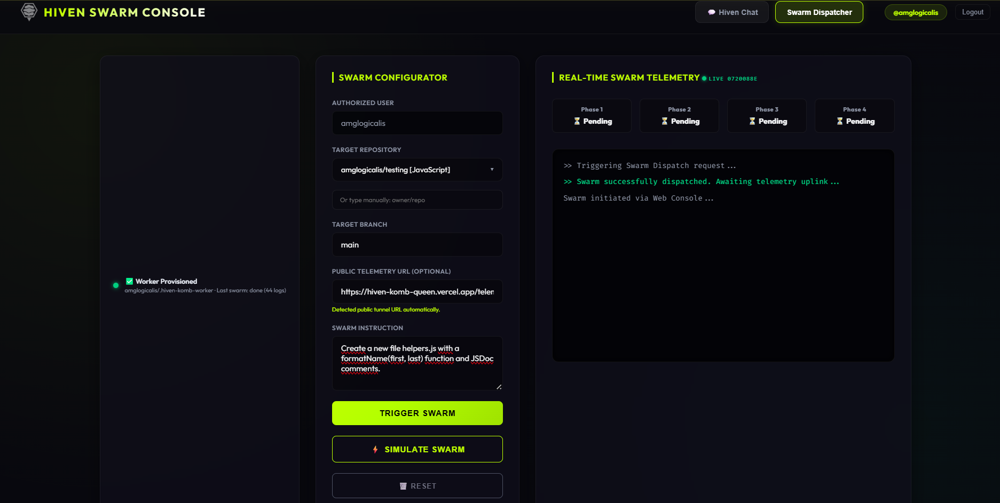
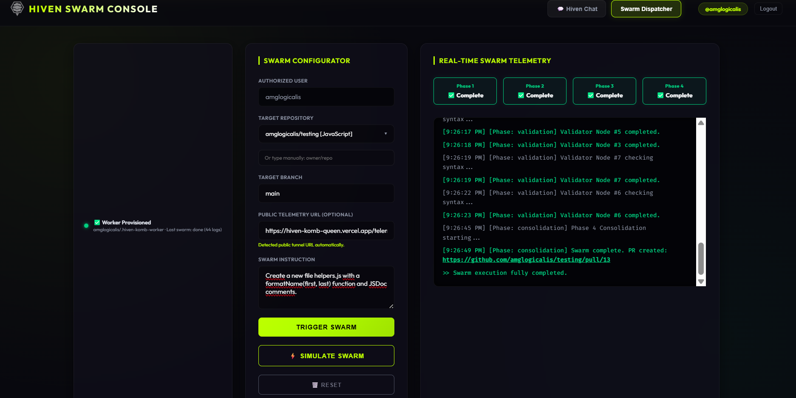
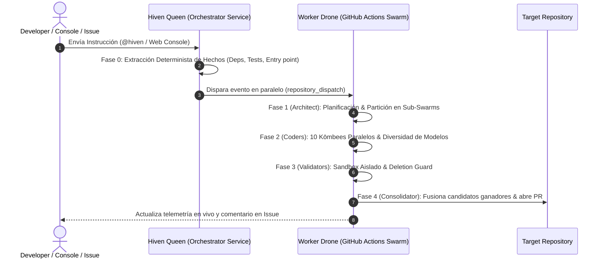

<p align="center">
  
</p>

<h1 align="center">🐝 Hiven Agent</h1>

<p align="center">
  <strong>El Asistente Autónomo de Software Multi-Agente para Desarrolladores e Indie Hackers</strong><br>
  <em>Cómputo efímero a Coste $0 • Sin Suscripciones Mensuales • Protección Anti-Corrupción de Código</em>
</p>

<p align="center">
  <a href="#-arquitectura-técnica-y-funcionamiento-del-enjambre"></a>
  <a href="#-protección-de-código-y-sandbox-aislado"></a>
  <a href="LICENSE.md"></a>
</p>

---

## 💡 ¿Qué es Hiven Agent?

**Hiven Agent** es una plataforma de ingeniería de software multi-agente descentralizada y de código abierto. Ha sido diseñada para ser la alternativa libre a servicios costosos de IA agéntica.

En lugar de cobrar cuotas mensuales o requerir servidores locales con GPUs costosas, **Hiven** coordina enjambres distribuidos de **Kōmbees** (Arquitectos, Codificadores, Validadores y Consolidadores) que se ejecutan de manera efímera y paralela en la infraestructura de GitHub Actions.

> [!IMPORTANT]
> **⏱️ Tiempo de Ejecución Promedio (Asíncrono)**:
> Debido a que Hiven ejecuta modelos de IA en runners efímeros **100% gratuitos de GitHub Actions**, el tiempo medio de ejecución de un Swarm oscila entre **3 y 8 minutos** (según el volumen del repositorio y la complejidad del prompt).
> **No es necesario mantener la pestaña abierta**: Hiven trabaja en segundo plano de forma asíncrona. Puedes cerrar la consola o continuar tu trabajo; recibirás la notificación con la Pull Request creada en tu repositorio en cuanto el enjambre finalice.

---

## 🎬 Demostración en Vivo (Demo Showcase)

### 📹 Vídeo en Acción: Respuesta Automática en GitHub Issues (`@hiven`)
Observa cómo **Hiven** recibe una instrucción en una Issue de GitHub, procesa la tarea con el enjambre multi-agente y crea la Pull Request verificada:


https://github.com/user-attachments/assets/f50d9408-4885-4238-8c82-483eeb1b65b1


---

### 🖥️ Consola Web de Hiven: Evolución del Enjambre en Tiempo Real

<p align="center">
  <strong>1. Estado Inicial (Lanzando el Swarm)</strong><br>
  
  <br><br>
  <strong>2. Estado Final (Swarm Completado & Pull Request Creada)</strong><br>
  
</p>

---

## ⚔️ ¿Por qué elegir Hiven? (Ventaja Competitiva)

| Característica / Ventaja | 🐝 Hiven Agent | 🤖 Copilot / Cursor | 💸 Devin / Sweep / SaaS |
|---|---|---|---|
| **Coste de Cómputo** | 🟢 **$0 / mes** (Runners efímeros) | 🟡 $10 - $20 / mes | 🔴 $20 - $500 / mes |
| **Arquitectura** | 🟢 **Enjambre Multi-Agente Competitivo** | 🔴 Mono-agente lineal (1 solo turno) | 🟡 Agente único centralizado |
| **Seguridad de Código** | 🟢 **Shadow Sandbox + Deletion Guard** | 🔴 Sin sandbox previo | 🟡 Limitado a tests estáticos |
| **Auto-Corrección** | 🟢 **Ciclos de Autocorrección** + Fallback | 🔴 No valida en tiempo de ejecución | 🟡 Corrección básica |
| **Privacidad & Control** | 🟢 **100% Open Source** | 🔴 Código en nubes privadas | 🔴 Datos en servidores de terceros |

---

## 🔬 Arquitectura Técnica y Funcionamiento del Enjambre

El motor de Hiven funciona como un pipeline de 4 Fases Orquestadas mediante una arquitectura **Master-Worker (Queen/Drone)**:



### 🧠 ¿Cómo se dividen las tareas en la Fase 1 y Fase 2?

Cuando le pides una tarea al Swarm, el trabajo no se procesa de forma ciega. Sigue un modelo de **Partición Inteligente y Ejecución Competitiva**:

1. **Fase 1 (Architect Kōmbee - Planificación)**:
   - El Arquitecto analiza la instrucción y la estructura del repositorio.
   - Si la tarea involucra un solo archivo o función, la asigna directamente.
   - Si la tarea es **multi-archivo** (ej. frontend + backend), el Arquitecto divide la petición en **Particiones Lógicas de Trabajo** (Grupo 1: Lógica/Backend, Grupo 2: UI/Estilos).

2. **Fase 2 (Coder Drones - 10 Nodos en Paralelo)**:
   - Los **10 Kōmbees** se distribuyen entre los grupos de particiones.
   - **Competencia entre Nodos**: Dentro de cada grupo, varios Kōmbees trabajan **en paralelo utilizando diferentes combinaciones de modelos (SLMs/LLMs) y temperaturas**.
   - Esto garantiza que, incluso si un modelo comete un error de sintaxis, otros nodos del mismo grupo generen variantes perfectas.

3. **Fase 3 (Validation Kōmbees - Shadow Sandbox)**:
   - Cada uno de los 10 nodos prueba su código en tiempo de ejecución (`node`, `npm test`, compiladores) dentro de un contenedor estéril e independiente.
   - Si un nodo rompe los tests o borra más del 50% de un archivo existente, ese nodo queda descalificado.

4. **Fase 4 (Consolidation Kōmbees - Fusión)**:
   - El Consolidador evalúa solo los nodos que pasaron la validación al 100%.
   - Selecciona al **candidato ganador de cada grupo de trabajo** y fusiona sus cambios en una **única Pull Request limpia**.

---

## 🛡️ Protección de Código y Sandbox Aislado

Hiven está diseñado bajo el principio de **Cero Confianza en la Generación de IA**:

1. **Shadow Sandbox Execution**: El código generado por los agentes se ejecuta y valida antes de tocar tu repositorio. Si los tests del proyecto fallan, el código no se aprueba.
2. **Code Deletion Guard**: Si un modelo intenta reescribir un archivo grande y elimina accidentalmente funciones preexistentes, el guardián de código frena la operación y restaura el archivo desde `git HEAD`.
3. **Memoria Colectiva (Pattern Learning)**: Si una ejecución no pasa el sandbox, el motivo del fallo se registra en la memoria federada para que los siguientes intentos aprendan qué patrones evitar.

---

## 📥 Instalación y Configuración Inicial (Paso a Paso)

Para empezar a usar Hiven en tus repositorios, solo necesitas completar 2 pasos sencillos:

### Paso 1: Instalar la GitHub App de Hiven
1. Haz clic en el enlace de instalación de la **[GitHub App de Hiven Agent](https://github.com/apps/hiven-agent)**.
2. Selecciona tu cuenta de usuario u organización.
3. Concede permisos de acceso a los repositorios donde deseas que Hiven trabaje (puedes elegir repositorios específicos o todos).

### Paso 2: Configurar tu Repositorio Worker Efímero (`.hiven-komb-worker`)
Hiven ejecuta los enjambres de forma gratuita utilizando runners efímeros de GitHub Actions:

- **En Organizaciones de GitHub**: Hiven creará y aprovisionará automáticamente el repositorio privado `.hiven-komb-worker` en tu organización en el primer uso.
- **En Cuentas Personales**: 
  1. Crea un repositorio privado/público (público es recomendado debido a que no hay limites de minutos corriendo en actions al mes, en repos privados si, 2000 min/mes) en tu cuenta de GitHub llamado exactamente **`.hiven-komb-worker`**.
  2. Asegúrate de otorgar acceso a la GitHub App de Hiven sobre este nuevo repositorio privado/público.
  3. ¡Listo! Hiven inicializará las plantillas de runners y empezará a procesar tus tareas.

---

## 🚀 Guía de Uso

### Opción A: Desde la Consola Web
1. Inicia sesión en la **Consola Web de Hiven**.
2. Selecciona tu repositorio destino.
3. Escribe la instrucción y haz clic en **Launch Swarm 🚀**.

### Opción B: Desde GitHub Issues o Pull Requests (`@hiven` / `/hiven`)
1. Comenta en cualquier Issue o PR de tu repositorio:
   ```text
   /hiven Añade una función formatCurrency(amount) a app.js con validaciones y JSDoc.
   ```
2. **Hiven** actualizará el progreso en tiempo real en la discusión y abrirá automáticamente la Pull Request.

---

## 💡 Guía de Prompting: Buenas Prácticas

| Principio | 🟢 Buena Práctica | 🔴 A Evitar |
|---|---|---|
| **Claridad y Alcance** | *"Añade una función `divide(a, b)` a `math.js` con validación de cero y JSDoc."* | *"Mejora el código."* (Demasiado vago). |
| **Nombres de Archivo** | Especifica los archivos si los conoces (`app.js`, `style.css`). | Esperar que el bot adivine el archivo en repos gigantes. |
| **Conservación** | No temas borrados: el **Code Deletion Guard** protege tu código preexistente. | Pedir borrados masivos sin usar palabras clave explícitas como `eliminar`. |

### 🔄 ¿Qué hacer si una tarea no pasa la validación del Sandbox?

Si una ejecución indica que no se generó código válido (el Sandbox frenó el cambio para proteger tu repositorio de código roto):

1. **Re-promptear especificando límites**: Indica explícitamente qué funciones o tests conservar (ej: *"Añade divide(a,b) a math.js conservando las aserciones preexistentes"*).
2. **Re-intentar directamente**: Gracias al **Pattern Learning**, el sistema recordará el fallo anterior e inyectará reglas de corrección automáticas.
3. **Subdividir la tarea**: Para cambios complejos, divide la instrucción en 2 o 3 micro-peticiones atómicas.

---

## 🛠️ Guía de Diagnóstico y Resolución de Errores (Troubleshooting)

### 🔴 Caso 1: `All 10 nodes failed validation`
* **Causa**: El **Shadow Sandbox** detectó que el código generado rompía la compilación o las pruebas en tiempo de ejecución.
* **Solución**: Re-promptea indicando qué funciones preexistentes no modificar o subdivide la tarea.

### 🔴 Caso 2: `Rejection: Code deletion safety guard triggered`
* **Causa**: Un nodo intentó borrar más del 50% de un archivo heredado.
* **Solución**: El archivo original se restaura automáticamente desde `git HEAD`. Re-intenta especificando las funciones a conservar.

### 🔴 Caso 3: `Worker Repository Not Found`
* **Causa**: Primera vez usando Hiven en tu cuenta.
* **Solución**: Crea un repositorio privado llamado **`.hiven-komb-worker`** e instala la App de Hiven en él.

### ⏱️ Caso 4: Tiempo de Ejecución Prolongado (3 a 8 minutos de media)
* **Comportamiento**: El Swarm permanece en la Fase 2 de Ejecución durante varios minutos.
* **Explicación**: Los runners efímeros de GitHub Actions son **100% gratuitos**, por lo que procesar las variantes de modelos de lenguaje en CPUs toma entre 3 y 8 minutos de media.
* **Solución**: No requiere ninguna acción por tu parte. El proceso es **100% asíncrono**; puedes cerrar la sesión y recibirás la Pull Request creada automáticamente en GitHub.

---

## 📜 Licencia

Distribuido bajo la Licencia MIT. Consulta [`LICENSE.md`](LICENSE.md) para más información.
