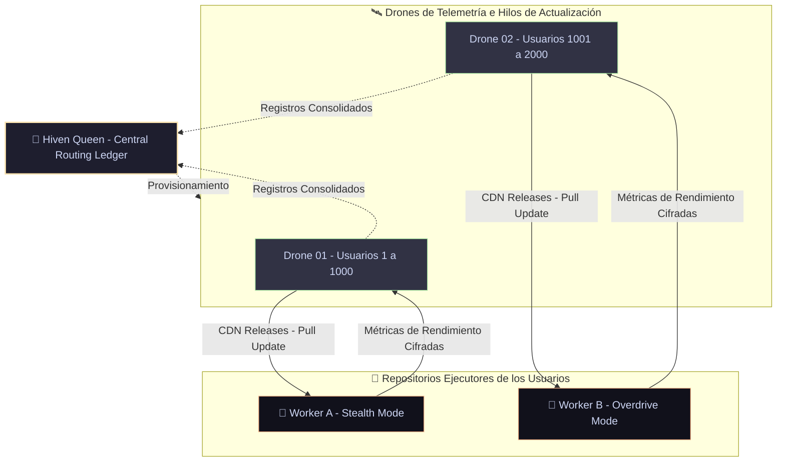

# 🐝 HIVEN

<p align="center">
  
</p>

<p align="center">
  <a href="https://github.com/hiven-core/hiven">
    
  </a>
  <a href="https://github.com/hiven-core/hiven">
    
  </a>
  <a href="https://github.com/hiven-core/hiven">
    
  </a>
</p>

<p align="center">
  <strong>Un asistente de software autónomo y multi-agente que transforma la infraestructura de CI/CD en un laboratorio neuronal descentralizado y gratuito.</strong>
</p>

<p align="center">
  <em>"Un pájaro (GitHub Copilot) ganaría a 2 o 3 o más abejas, pero un enjambre (Swarm) de abejas siempre gana al pájaro. ¡La unión hace la fuerza!"</em>
</p>

---

## ⚡ Simulación de Ejecución del Enjambre (Swarm Flow)

*Haz clic en las barras inferiores para expandir la telemetría en tiempo real de los agentes operando en paralelo:*

<details open>
  <summary style="font-weight: bold; color: #f9e2af; cursor: pointer; padding: 10px; background-color: #1e1e2e; border-radius: 6px; margin-bottom: 5px; list-style: none; border: 1px solid #313244;">
    🔍 FASE 1: CONTEXTO (2 Nodos Kōmbees)
  </summary>
  <blockquote style="border-left: 4px solid #f9e2af; padding-left: 15px; margin-left: 10px; color: #a6adc8;">
    <p><strong>[Hiven-Reader]</strong> Leyendo estructura del repositorio y analizando dependencias del sistema... Done.<br>
    <strong>[Hiven-Architect]</strong> Formulando plan de refactorización detallado para inyectar métodos asíncronos...</p>
    <pre><code>⚙️ Plan:
1. Modificar math.js para añadir control de límites.
2. Crear suite de pruebas unitarias en math.test.js.</code></pre>
  </blockquote>
</details>

<details>
  <summary style="font-weight: bold; color: #a6e3a1; cursor: pointer; padding: 10px; background-color: #1e1e2e; border-radius: 6px; margin-bottom: 5px; list-style: none; border: 1px solid #313244;">
    💻 FASE 2: EJECUCIÓN COMPETITIVA (10 Nodos Kōmbees)
  </summary>
  <blockquote style="border-left: 4px solid #a6e3a1; padding-left: 15px; margin-left: 10px; color: #a6adc8;">
    <p>Generación paralela de código con variación de temperatura en Ollama (SLM: Qwen2.5-Coder:1.5b):</p>
    <ul>
      <li>Node 01 (Temp 0.1) -> <em>Código generado (Exitoso)</em></li>
      <li>Node 02 (Temp 0.3) -> <em>Código generado (Exitoso)</em></li>
      <li>Node 03 (Temp 0.5) -> <em>Código generado (Advertencia de sintaxis)</em></li>
      <li>... [7 nodos ejecutando en paralelo en GitHub Actions Matrix]</li>
    </ul>
  </blockquote>
</details>

<details>
  <summary style="font-weight: bold; color: #89b4fa; cursor: pointer; padding: 10px; background-color: #1e1e2e; border-radius: 6px; margin-bottom: 5px; list-style: none; border: 1px solid #313244;">
    🛡️ FASE 3: VALIDACIÓN Y CORRECCIÓN (6 Nodos Kōmbees)
  </summary>
  <blockquote style="border-left: 4px solid #89b4fa; padding-left: 15px; margin-left: 10px; color: #a6adc8;">
    <p><strong>[Hiven-Tester]</strong> Ejecutando suite de pruebas unitarias en máquina virtual...<br>
    ❌ <em>Fallo en test: Caso factorial(-5) no lanza excepción.</em><br>
    <strong>[Hiven-Reviewer]</strong> Enviando traza de error de compilación de regreso a Coder para autocorrección...<br>
    🔄 <em>Ciclo de corrección 1... Pruebas pasadas con éxito! [100% OK]</em></p>
  </blockquote>
</details>

<details>
  <summary style="font-weight: bold; color: #fab387; cursor: pointer; padding: 10px; background-color: #1e1e2e; border-radius: 6px; margin-bottom: 5px; list-style: none; border: 1px solid #313244;">
    🚀 FASE 4: CONSOLIDACIÓN Y TELEMETRÍA (2 Nodos Kōmbees)
  </summary>
  <blockquote style="border-left: 4px solid #fab387; padding-left: 15px; margin-left: 10px; color: #a6adc8;">
    <p><strong>[Hiven-Committer]</strong> Fusionando cambios en la rama <code>hiven/patch-a8f1</code>.<br>
    <strong>[Hiven-Uplink]</strong> Creando Pull Request en el repositorio origen del usuario.<br>
    <strong>[Hiven-Uplink]</strong> Enviando reporte de telemetría anonimizado al Drone de balanceo... Done.</p>
  </blockquote>
</details>
---

## ⚔️ Hiven Swarm vs. GitHub Copilot: ¿Por qué la unión hace la fuerza?

GitHub Copilot es una herramienta excelente para autocompletar líneas de código mientras escribes. Sin embargo, cuando se le delega una tarea compleja (como refactorizar un módulo completo o implementar una lógica de negocio robusta de extremo a extremo), suele fallar debido a su naturaleza lineal de un solo turno.

Hiven destruye este límite mediante su **Arquitectura Kōmb Multi-Agente**:

### 1. Descomposición de Tareas (Divide y Vencerás)
Copilot intenta procesar instrucciones complejas en un solo bloque de texto, lo que genera alucinaciones y código incompleto. **Hiven descompone la instrucción** en micro-tareas atómicas (Fase 1: Architect) que son ejecutadas de forma independiente por el enjambre de Kōmbees.

### 2. Validación Basada en AST y Compilador (Auto-Corrección)
Copilot no ejecuta tu código ni sabe si compila; te devuelve el texto tal cual. **Hiven valida sintácticamente el código generado** en tiempo de ejecución (Fase 3: Validator) mediante aserciones y compiladores locales (`node -c`). Si detecta un fallo, el Swarm extrae la línea exacta de error y retroalimenta al codificador en un bucle cerrado de autocorrección hasta lograr un éxito del 100%.

### 3. Cómputo Descentralizado a Coste Cero ($0)
En lugar de pagar costosas cuotas mensuales de servidores en la nube, Hiven ejecuta modelos locales altamente optimizados (`GGUF` en Ollama) de forma distribuida en los contenedores gratuitos de tu propia infraestructura de CI/CD (GitHub Actions) o localmente.

---

## 📊 Reporte de Rendimiento y Benchmarks
El enjambre optimizado fue puesto a prueba localmente contra retos algorítmicos complejos sobre CPU estándar:

| Desafío / Algoritmo | Complejidad | Estatus | Tiempo de Swarm (s) | Desglose por Fase |
| :--- | :---: | :---: | :---: | :--- |
| **Bubble Sort Algorithm** | HIGH | ✅ PASADO | 243.69s | P1: 105.3s, P2: 137.6s, P3: 0.5s, P4: 0.3s |
| **Factorial (Negative Bounds)** | HIGH | ✅ PASADO | 146.53s | P1: 62.2s, P2: 83.4s, P3: 0.6s, P4: 0.3s |
| **Prime Checker** | LOW | ✅ PASADO | 170.49s | P1: 59.7s, P2: 98.8s, P3: 11.6s, P4: 0.4s |

* **Tasa de éxito funcional (PRs Listos):** **100.0% (3/3 retos)**
* **Tiempo Promedio por Tarea Completa:** **186.91 segundos** (menos de 3 minutos para delegar un desarrollo funcional completo y verificado).

---

## 🏗️ Topología del Ecosistema (Kōmb Architecture)



---

## 🥷 Modos de Operación: Privacidad vs Cómputo Ilimitado

Controla las cuotas del enjambre según los requerimientos de tu proyecto:

```
        MODO STEALTH (Privado)                  MODO OVERDRIVE (Público)
  ┌─────────────────────────────────┐     ┌─────────────────────────────────┐
  │  • Repositorio .worker privado  │     │  • Repositorio .worker público  │
  │  • Consumo de minutos gratis    │     │  • Minutos de Actions INFINITOS │
  │  • 2,000 mins/mes por usuario   │     │  • Cómputo ilimitado a coste $0 │
  │  • Máxima privacidad de código  │     │  • honey.db compartida          │
  └─────────────────────────────────┘     └─────────────────────────────────┘
```

---

## 🧠 Optimización de Memoria (honey.db)

El Worker mantiene una caché ligera cifrada llamada `honey.db` para retener directivas estilísticas y firmas de errores históricos.
* **Privacidad Perimetral:** El código fuente jamás se guarda en la base de datos.
* **Anti-Envenenamiento (Anti-Poisoning):** Sanitización activa para evitar inyección de directivas condicionales maliciosas.

---

## 🚀 Integración e Instalación en 3 Pasos

```bash
# 1. Instala el CLI de Hiven
npm install -g hiven-cli

# 2. Registra tu cuenta y vincula el token
hiven auth login

# 3. Despierta el enjambre en cualquier repositorio
hiven run "Añade un middleware de JWT en express"
```

*También puedes invocar al enjambre directamente en GitHub comentando en cualquier Issue o Pull Request:* `/hiven refactor: optimiza la consulta SQL`.
