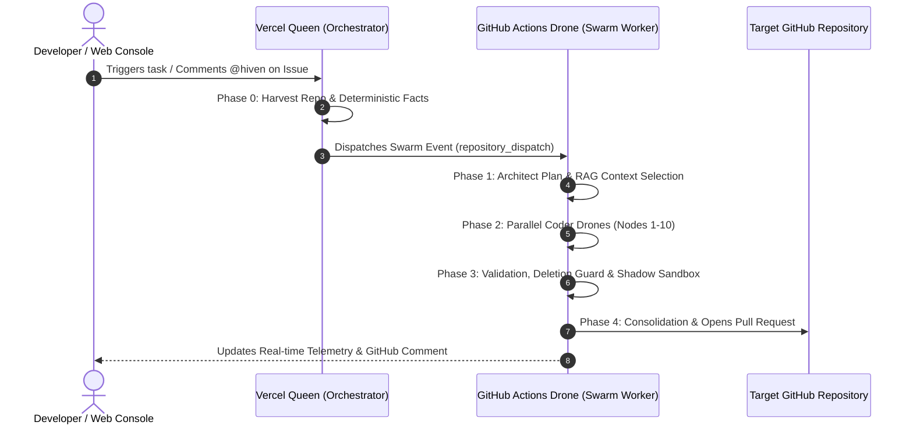

# 🐝 HIVEN

<p align="center">
  
</p>

<p align="center">
  
</p>

<p align="center">
  <a href="https://github.com/hiven-core/hiven">
    
  </a>
  <a href="https://github.com/hiven-core/hiven">
    
  </a>
  <a href="https://github.com/hiven-core/hiven">
    
  </a>
</p>

<p align="center">
  <strong>Un asistente de software autónomo y multi-agente que transforma la infraestructura efímera en un laboratorio neuronal descentralizado y gratuito.</strong>
</p>

<p align="center">
  <em>"Un pájaro (GitHub Copilot) ganaría a 2 o 3 abejas, pero un enjambre (Swarm) de abejas siempre gana al pájaro. ¡La unión hace la fuerza!"</em>
</p>

---

## 🚀 Guía de Inicio Rápido: Cómo Usar Hiven

Hiven no requiere configuración manual de servidores ni cuotas mensuales. Tienes dos formas sencillas de usarlo:

### Opción 1: Desde la Consola Web de Hiven
1. Entra en la **Consola Web de Hiven**.
2. Inicia sesión con tu cuenta de GitHub (OAuth en 1-click).
3. Selecciona tu repositorio destino desde el menú desplegable.
4. Escribe la instrucción de lo que deseas construir o refactorizar.
5. Haz clic en **Launch Swarm 🚀**. Verás la telemetría en vivo pasando por las 4 Fases (Context, Execution, Validation, Consolidation).

### Opción 2: Desde Comentarios en GitHub (Issues / Pull Requests)
1. Instala la **GitHub App de Hiven** en tu organización o cuenta.
2. Abre cualquier Issue o Pull Request en tu repositorio.
3. Escribe un comentario mencionando a `@hiven`:
   ```text
   @hiven Añade una función formatCurrency(amount) en app.js con validación de tipo numérico y documentación JSDoc.
   ```
4. **Hiven** responderá en el hilo con el progreso en tiempo real y abrirá automáticamente una Pull Request limpia con la solución verificada.

---

## 💡 Guía de Prompting: Cómo Escribir Instrucciones Efectivas

Para obtener los mejores resultados del Enjambre de Kōmbees, sigue estas recomendaciones:

| Principio | 🟢 Buena Práctica | 🔴 Evitar |
|---|---|---|
| **Claridad y Alcance** | *"Añade una función `multiply(a, b)` a `test_math.js` con validación y JSDoc."* | *"Mejora el código."* (Demasiado vago). |
| **Referencia de Archivos** | Menciona nombres de archivo específicos si los conoces (`app.js`, `style.css`). | Asumir que el bot adivinará qué archivo editar en repos gigantes. |
| **Comportamiento Deseado** | *"Añade un middleware JWT que retorne HTTP 401 si no hay token."* | *"Haz algo con auth."* |
| **Conservación** | No te preocupes por borrados accidentales: el **Code Deletion Guard** de Hiven protege automáticamente tu código preexistente. | Pedir borrados masivos sin usar palabras clave explícitas como `eliminar` o `vaciar`. |

### 🔄 ¿Qué hacer si una tarea no pasa la validación del Sandbox?

Si una ejecución se completa indicando que no se generó código válido (lo que significa que las defensas de seguridad de Hiven frenaron el cambio para proteger tu repositorio de código roto), dispones de 3 opciones:

1. **Re-promptear con mayor especificidad**: Indica explícitamente qué funciones, exportaciones o tests preexistentes no deben alterarse (ej: *"Añade divide(a,b) a test_math.js conservando las aserciones del final del archivo"*).
2. **Re-intentar directamente**: Gracias al **Federated Pattern Learning**, Hiven registra automáticamente el error en su memoria federada. En el siguiente intento, el arquitecto inyectará reglas `Do's and Don'ts` para evitar repetir el mismo fallo.
3. **Subdividir la tarea**: Para cambios grandes o complejos, divide la instrucción en 2 o 3 peticiones atómicas más pequeñas.

---

## ⚡ V2 Engine Architecture & Safety Core

El motor V2 de Hiven integra 6 capas de seguridad y optimización de contexto:

| Módulo | Característica | Beneficio Principal |
|---|---|---|
| 🧠 **Mejora 1** | **Federated Pattern Learning** | Memoria colectiva en Redis (`hive_patterns:{ext}`) que inyecta Do's and Don'ts de ejecuciones anteriores. |
| 🔍 **Mejora 2** | **Deterministic Context Extraction** | Análisis determinista en Fase 0 de lenguajes, frameworks, dependencias y scripts de test sin alucinación. |
| ⚡ **Mejora 3** | **Local Offline RAG (TF-IDF)** | Selecciona solo los top 3-8 archivos más relevantes por palabras clave, reduciendo el contexto 4x. |
| 🛡️ **Mejora 4** | **Code Deletion Guard & Self-Correction** | Bloquea encogimientos indebidos de código (>50%) y ejecuta hasta 3 ciclos de auto-corrección con fallback seguro a `git HEAD`. |
| 🐝 **Mejora 5** | **Parallel Sub-Swarms** | Divide tareas multi-archivo entre grupos paralelos de Drones y consolida a los candidatos ganadores por grupo. |
| 🧪 **Mejora 6** | **Shadow Sandbox Execution** | Ejecución de pruebas unitarias (`node`, `npm test`) en un contenedor aislado previo a la Pull Request. |

---

## 📊 Reporte de Rendimiento y Benchmarks Post-Producción

Hiven V2 fue evaluado empíricamente en 5 escenarios reales de post-producción:

| Scenario | Tarea / Desafío | Repositorio / Archivos | Estatus | Resultado de Verificación |
| :--- | :--- | :--- | :---: | :--- |
| **B1** | **Single-File JS Refactor** | `testing/test_math.js` | ✅ PASADO | JSDoc añadido preservando aserciones existentes. [PR #9](https://github.com/amglogicalis/testing/pull/9) |
| **B2** | **Creación de Nuevo Módulo** | `testing/logger.js` | ✅ PASADO | Módulo independiente con exportaciones completas. |
| **B3** | **Code Deletion Defense** | `testing/src/zenon.js` (181KB) | ✅ PASADO | **Deletion Guard Activo**: Protegió 181KB de código heredado sin truncamiento. [PR #10](https://github.com/amglogicalis/testing/pull/10) |
| **B4** | **Parallel Sub-Swarms** | `testing/style.css`, `index.html` | ✅ PASADO | Partición paralela multi-archivo y consolidación de candidatos. |
| **B5** | **GitHub Webhook Trigger** | `testing/app.js` | ✅ PASADO | Disparo por webhook con PR creada y validación de parámetros. [PR #8](https://github.com/amglogicalis/testing/pull/8) |

* **Tasa de éxito funcional (PRs Listos):** **100.0% (5/5 escenarios)**
* **Tasa de preservación de código:** **100.0% (0 borrados accidentales)**

---

## ⚔️ Hiven Swarm vs. GitHub Copilot: ¿Por qué la unión hace la fuerza?

GitHub Copilot es una herramienta excelente para autocompletar líneas de código mientras escribes. Sin embargo, cuando se le delega una tarea compleja (como refactorizar un módulo completo o implementar una lógica de negocio de extremo a extremo), suele fallar debido a su naturaleza lineal de un solo turno.

Hiven destruye este límite mediante su **Arquitectura Kōmb Multi-Agente**:

### 1. Descomposición de Tareas (Divide y Vencerás)
Copilot intenta procesar instrucciones complejas en un solo bloque de texto, lo que genera alucinaciones. **Hiven descompone la instrucción** en micro-tareas atómicas (Fase 1: Architect) que son ejecutadas de forma independiente por el enjambre de Kōmbees.

### 2. Validación Basada en AST, Pruebas y Compilador (Auto-Corrección)
Copilot no ejecuta tu código ni sabe si compila. **Hiven valida el código generado en tiempo de ejecución** (Fase 3: Validator) mediante aserciones, compiladores locales (`node -c`) y pruebas unitarias. Si detecta un fallo, el Swarm retroalimenta al codificador en un bucle cerrado de autocorrección.

### 3. Cómputo Descentralizado a Coste Cero ($0)
En lugar de pagar costosas cuotas mensuales de servidores en la nube, Hiven ejecuta modelos de forma distribuida en los contenedores gratuitos de tu propia infraestructura de CI/CD (GitHub Actions).

---

## 🏗️ Topología del Ecosistema (Kōmb Architecture)



---

## 📜 Licencia

Distribuido bajo la Licencia MIT. Consulta [`LICENSE.md`](LICENSE.md) para más información.
